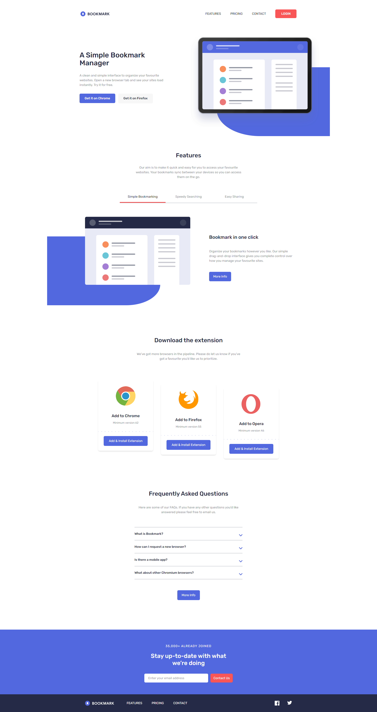

# Frontend Mentor - Bookmark landing page solution

This is a solution to the [Bookmark landing page challenge on Frontend Mentor](https://www.frontendmentor.io/challenges/bookmark-landing-page-5d0b588a9edda32581d29158). Frontend Mentor challenges help you improve your coding skills by building realistic projects.

## Table of contents

- [Overview](#overview)
  - [The challenge](#the-challenge)
  - [Screenshot](#screenshot)
  - [Links](#links)
- [My process](#my-process)
  - [Built with](#built-with)
- [Author](#author)
- [Acknowledgments](#acknowledgments)

## Overview

### The challenge

Users should be able to:

- View the optimal layout for the site depending on their device's screen size
- See hover states for all interactive elements on the page
- Receive an error message when the newsletter form is submitted if:
  - The input field is empty
  - The email address is not formatted correctly

### Screenshot

### Links

- Solution URL: [Solution](https://github.com/dawidwojtaszek/Bookmark-Landing-Page-using-Tailwind-CSS)
- Live Site URL: [Live site](https://bookmark-fem-chalange.netlify.app/)

## My process

### Built with

- HTML
- Tailwind CSS
- Javascript

## Author

- Website - [Dawid Wojtaszek](https://www.dawidwojtaszek.pl)
- Frontend Mentor - [@dawidwojtaszek](https://www.frontendmentor.io/profile/dawidwojtaszek)

## Acknowledgments

https://youtu.be/aB9-1BRTx3Y - This tutorial helped me a lot in creation of collapse tabs
